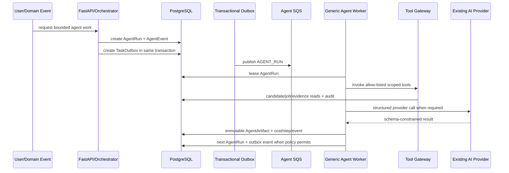

# ApplyAI Governed Agent Runtime Architecture

Updated: 2026-08-10

## Purpose

The Agent Runtime makes career automation durable and governable. It does **not** create permanent chatbots. Workflows are persisted in PostgreSQL; bounded agent steps are scheduled through the existing transactional outbox and SQS worker architecture.

## Release 1

Release 1 contains four production agent definitions:

1. `job_scout:v1`
2. `job_research:v1`
3. `resume_tailor:v1`
4. `resume_verifier:v1`

Application execution, outbound messaging, interview automation, networking, strategy missions and broader autonomous actions are future releases.

## Runtime sequence



The model never owns workflow state. A process crash, deployment or provider timeout cannot erase the workflow.

## Durable records

- `agent_runs` — one bounded execution attempt stream for one agent definition and candidate scope.
- `agent_steps` — persisted execution steps and retry evidence.
- `agent_events` — orchestration/domain evidence.
- `agent_artifacts` — immutable versioned outputs with lineage and evidence refs.
- `agent_tool_calls` — audited tool metadata; sensitive raw resume bodies are not copied into audit telemetry.
- `agent_approvals` — durable approval records for future `EXECUTE` actions.
- `agent_cost_events` — provider/model token and measured cost attribution.
- `agent_runtime_policies` — operator pause/enable and budget overrides.

## State machine

```text
QUEUED -> CLAIMED -> RUNNING -> VALIDATING -> SUCCEEDED
                       |            |
                       |            +-> FAILED_RETRYABLE -> QUEUED
                       +-> WAITING_FOR_TOOL
                       +-> WAITING_FOR_APPROVAL
                       +-> FAILED_TERMINAL
                       +-> CANCELLED
```

Invalid transitions are rejected. Terminal runs cannot restart without an explicit operator retry workflow.

## Idempotency

Root work uses a stable key derived from candidate, job, agent/version and stable input. Workflow children share the workflow ID. Duplicate SQS delivery therefore does not create duplicate logical artifacts or external actions.

## Leases

A worker row-locks and leases a run with `lease_owner`, `lease_acquired_at`, `lease_expires_at` and `heartbeat_at`. A live lease blocks another worker. An expired lease can be recovered safely.

## Tool boundary

Agent definitions contain allow/deny lists. The Tool Gateway enforces:

1. agent definition permission;
2. tool execution class;
3. candidate/resource scope;
4. audited execution.

External text can never register or authorize a tool.

## First workflow

```text
Canonical job
    -> Job Scout
       -> STRONG/APPLY_NOW only
          -> Job Research
             -> Resume Tailor
                -> Resume Verifier
                   -> PASS/PASS_WITH_WARNINGS
                      -> READY_FOR_CANDIDATE
```

`REJECT`, `LOW_PRIORITY` and `CONSIDER` do not automatically spend research/resume tokens.

## Bulk filtering boundary

Agents are a final reasoning layer, not a catalog scan engine. Candidate/job targeting must use SQL filters, existing search/semantic matching and deterministic rules before an agent run is created. Release 1 event-trigger targeting is bounded and does not fan out over the full candidate × job matrix.

## Queue topology

Release 1 deploys one dedicated governed-agent SQS queue/DLQ and one generic worker image. Each run also records a logical queue class (`agent-fast`, `agent-research`, `agent-generation`, `agent-action`) so physical queue separation can be introduced without changing agent contracts if measured contention justifies it.

## Provider integration

Agents reuse `app.ai.provider`; they do not import a provider SDK directly. Deterministic mode is used for repository/clean-room evidence. Live model evidence requires configured staging.

## Evidence levels

- `DESIGNED`
- `IMPLEMENTED`
- `TESTED`
- `LOCAL_RUNTIME_VERIFIED`
- `LIVE_STAGING_VERIFIED`
- `PRODUCTION_VERIFIED`

Synthetic benchmarks and deterministic local provider runs are never presented as live-provider evidence.
